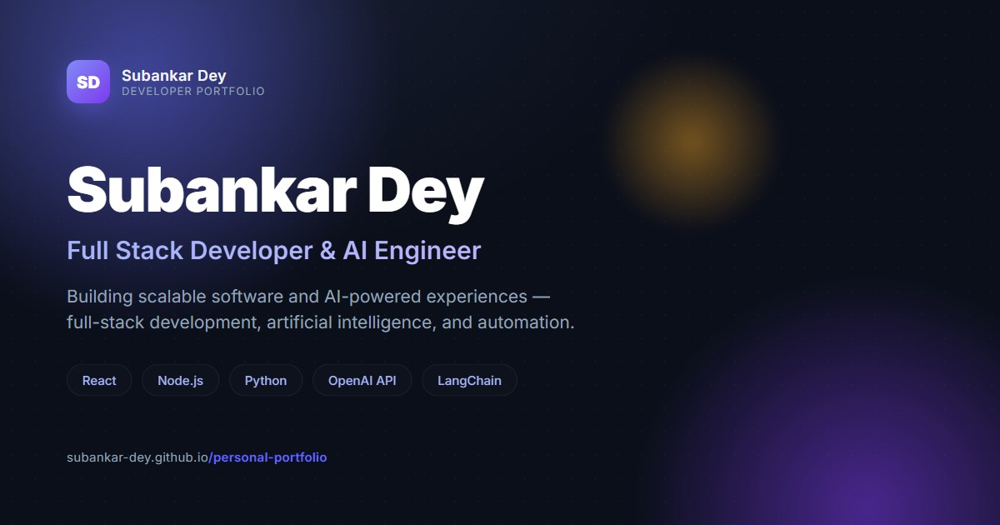

# 🚀 Subankar Dey - Personal Portfolio

A modern, high-performance, and responsive personal portfolio website built to showcase my career journey, technical skills, and featured projects. 

This portfolio acts as a living resume while I pursue my Bachelor of Technology in Computer Science and Engineering at Osmania University, actively targeting roles in **Software Engineering**, **Web Development**, and **AI/ML**.

**🔗 Live Site:** [subankar-dey.github.io/personal-portfolio](https://subankar-dey.github.io/personal-portfolio/)



---

## 📌 Features

- ⚡ **Lightning-fast development** powered by Vite
- ⚛️ **Modern Architecture** built on React.js
- 🎨 **Indigo/Violet Glassmorphism Design** styled beautifully using pure Tailwind CSS and custom properties
- ✨ **Scroll-triggered animations** via a reusable `IntersectionObserver` hook, with `prefers-reduced-motion` support
- 🔒 **Dynamic Contact Integration** securely wired with EmailJS for direct communication
- 📁 **Modular component rendering** ensuring top-tier visual performance on both mobile and desktop screens
- 🔍 **SEO-ready**: Open Graph & Twitter Card metadata, canonical URL, `robots.txt`, `sitemap.xml`, and a custom favicon set
- 🖋️ **Self-hosted fonts** (Inter & Playfair Display via Fontsource) — no external font requests
- 🖼️ **Custom visual assets**: social preview banner, hero background, and per-project thumbnails, all generated to match the brand's design tokens

---

## 🛠️ Personal Tech Stack

- **Frontend & Styling:** React.js, Vite, JavaScript (ES6+), HTML5, CSS3, Tailwind CSS, Bootstrap 4
- **Backend & Relational:** Node.js, Express, PHP, MySQL, PostgreSQL, MongoDB, SQLite
- **Languages:** Python, Java (OOP), C/C++
- **AI & Automation:** OpenAI API, Gemini API, Claude API, LangChain, RAG, n8n Workflows
- **Ecosystems & Tools:** Git, Docker, Linux, Kali Linux, Postman, Chart.js

---

## 💼 Featured Work Included

1. **Autonomous WhatsApp AI Chatbot & Workflow Automation** - An n8n-orchestrated conversational agent integrating OpenAI/Gemini APIs for automated customer support and business workflows.
2. **AI Voice Agent & Conversational Telephony** - An end-to-end voice AI pipeline (Whisper STT, LLM reasoning, ElevenLabs TTS) handling real-time calls via Twilio Voice API.
3. **Student Attendance Management System** - A multi-role PHP/MySQL application engineered with robust RBAC handling and graphical Chart.js analytics.
4. **Real-Time Messaging Platform** - A highly secure, low-latency asynchronous messenger using modern AJAX.

---

## 📦 Local Installation

### 1. Clone the repository

```bash
git clone https://github.com/Subankar-Dey/personal-portfolio.git
```

### 2. Navigate & Install Dependencies
```bash
cd personal-portfolio
npm install
```

### 3. Setup Environment Variables
Copy `.env.example` to `.env` and fill in your EmailJS credentials and social links:
```bash
cp .env.example .env
```
```env
VITE_GITHUB_URL=your_github_url
VITE_LINKEDIN_URL=your_linkedin_url
VITE_TWITTER_URL=your_twitter_url
VITE_INSTAGRAM_URL=your_instagram_url

VITE_EMAILJS_SERVICE_ID=your_id
VITE_EMAILJS_TEMPLATE_ID=your_template
VITE_EMAILJS_PUBLIC_KEY=your_key
```
The social link variables are optional — `src/constants/links.js` falls back to sensible defaults if they're unset. The EmailJS variables are required for the contact form to send messages.

### 4. Run the Project
Start the development server:
```bash
npm run dev
```
Then navigate to: `http://localhost:5173/personal-portfolio/`

---

## 🌐 Deployment (GitHub Pages)

This repo includes a GitHub Actions workflow (`.github/workflows/deploy.yml`) that builds and deploys the site to GitHub Pages automatically on every push to `main`.

**One-time setup:**

1. In the repo, go to **Settings → Pages** and set **Source** to `GitHub Actions`.
2. Go to **Settings → Secrets and variables → Actions** and add these repository secrets so the production build has your real values (the app reads them via `import.meta.env` at build time):
   ```
   VITE_GITHUB_URL
   VITE_LINKEDIN_URL
   VITE_TWITTER_URL
   VITE_INSTAGRAM_URL
   VITE_EMAILJS_SERVICE_ID
   VITE_EMAILJS_TEMPLATE_ID
   VITE_EMAILJS_PUBLIC_KEY
   ```
3. Push to `main` (or re-run the workflow from the **Actions** tab). The site publishes to:
   ```
   https://subankar-dey.github.io/personal-portfolio/
   ```

---

## 📊 Recruiter Slide Deck

A standalone, self-contained presentation for recruiters lives at [`slides/recruiter-deck.html`](slides/recruiter-deck.html) — 6 slides covering intro, technical profile, skills, featured projects, AI capabilities, and contact info, styled to match the site's design system. It's fully offline (fonts and images are bundled locally) and separate from the Vite build — just open the file directly in a browser. Use arrow keys, click, or the on-screen controls to navigate.

---

## 🙌 Author

**Subankar Dey**  
🎓 3rd-year CS Student at Osmania University | Full-Stack & AI Developer  
📍 Hyderabad, Telangana-500007  

- GitHub: [Subankar-Dey](https://github.com/Subankar-Dey)
- LinkedIn: [Subankar Dey](https://www.linkedin.com/in/subankar-dey-90323127b/)

## 📄 License

This project is licensed under the MIT License.
